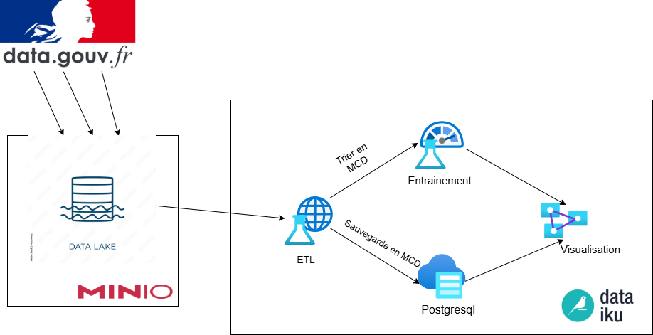
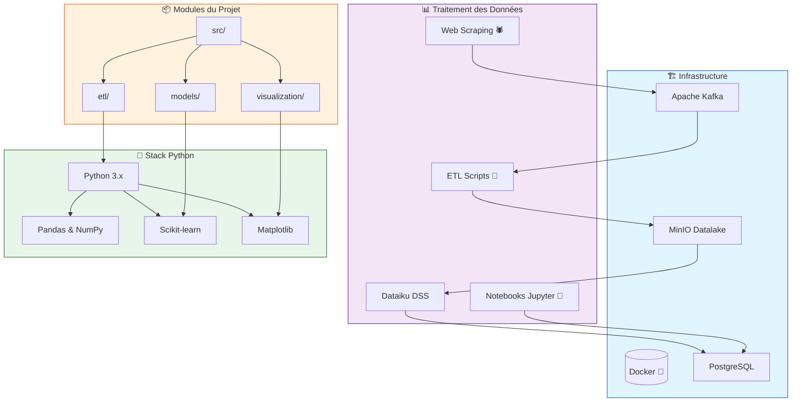

# Projet de Prédiction Électorale - POC

> Ce projet est réalisé dans le cadre d'une MSPR. Pour plus de détails sur les objectifs et les exigences du projet, consultez le [sujet détaillé](Subject.md).

## 📋 Description du Projet

Preuve de concept (POC) développée pour Elexxion, une start-up spécialisée dans le conseil électoral. L'objectif est de créer un modèle d'intelligence artificielle capable de prédire les tendances électorales en se basant sur des données socio-économiques, de sécurité et d'emploi.

## 🏗️ Structure du Projet

```shell
.
├── notebooks/           # Notebooks Jupyter pour l'analyse exploratoire
├── src/                 # Code source du projet
│   ├── etl/             # Scripts de collecte et transformation des données
│   ├── models/          # Modèles de prédiction
│   └── visualization/   # Outils de visualisation
├── init-scripts/        # Scripts d'initialisation de la base de données
└── docker-compose.yml   # Configuration Docker
```

## 📊 Architecture du Projet

- 
  


## 🛠️ Technologies Utilisées

- **Python 3.x** avec les bibliothèques :
  - Pandas & NumPy : Manipulation des données
  - Scikit-learn : Modélisation prédictive
  - Matplotlib : Visualisation
- **Infrastructure Data :**
  - Apache Kafka : Streaming de données en temps réel
  - MinIO : Stockage d'objets S3-compatible
  - PostgreSQL : Base de données relationnelle
- **Outils de Data Science :**
  - Dataiku DSS : Plateforme de Data Science
  - Kafka UI : Interface de gestion Kafka
- **Docker** : Conteneurisation et orchestration des services
- **SQL** : Requêtage et analyse des données

## 🚀 Installation et Démarrage

1. **Cloner le repository** :

   ```bash
   git clone <url-du-repo>
   cd <nom-du-repo>
   ```

2. **Installer les dépendances** :

   ```bash
   pip install -r requirements.txt
   ```

3. **Lancer les conteneurs Docker** :

   ```bash
   docker-compose up -d
   ```

4. **Exécuter le projet** :

   ```bash
   python main.py
   ```

## 📊 Utilisation  

Le projet se compose de trois parties principales :

1. **Collecte et Transformation des Données** :
   - Scripts Python dans `src/etl/` pour collecter et transformer les données.
   - Utilisation de Docker pour la gestion des bases de données.
2. **Modélisation Prédictive** :
   - Scripts Python dans `src/models/` pour la création et l'entraînement des modèles.
3. **Visualisation des Résultats** :
   - Scripts Python dans `src/visualization/` pour générer des visualisations.
  
## 🤝 Contribution  

Ce projet est développé dans le cadre d'un travail d'équipe de 4-5 étudiants. Pour contribuer :

1. Forkez le repository.
2. Créez une nouvelle branche : `git checkout -b feature/nom-de-la-fonctionnalité`.
3. Faites vos modifications et commit : `git commit -m 'Ajout de la fonctionnalité X'`.
4. Poussez vers la branche : `git push origin feature/nom-de-la-fonctionnalité`.
5. Ouvrez une Pull Request.
