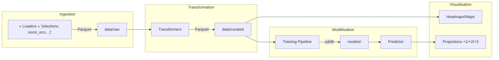

# Projet de Prédiction Électorale – POC

> Travail réalisé dans le cadre de la MSPR « Data Lake & IA ». Pour le cahier des charges détaillé, consultez le [sujet](Subject.md).

---

## ✨ Objectif

Mettre en place une **preuve de concept** pour **Elexxion**, jeune pousse spécialisée dans le conseil électoral, capable de :

1. Collecter puis normaliser des données publiques (INSEE, data.gouv, etc.) ou **générer des données factices** pour accélérer les tests.
2. Croiser ces données avec les résultats électoraux historiques.
3. Entraîner un modèle supervisé afin de **prédire le bloc vainqueur** à +1, +2 et +3 ans.
4. Visualiser indicateurs, corrélations et projections futures.

---

## 🗂️ Arborescence du dépôt

```text
.
├── assets/                # diagrammes, jeu de communes, géojson…
│   ├── architecture.png
│   ├── architecture2.png
│   └── communes.csv
├── init-scripts/          # scripts SQL pour provisionner PostgreSQL
├── src/
│   ├── ingestion/         # loaders + orchestration (mode API ou Fake)
│   ├── transformation/    # transformers & fusion
│   ├── prediction/        # entraînement + prédicteur
│   └── visualization/     # graphiques et cartes
├── notebooks/             # analyses exploratoires
├── test/                  # tests unitaires (pytest)
├── config.yml             # active le mode `api` ou `fake`
├── main.py                # CLI d’orchestration (ingest → train → predict…)
├── docker-compose.yml     # services : PostgreSQL, MinIO, Kafka…
└── requirements.txt       # dépendances Python
```

> **Nouveauté** : la CLI expose le switch `--mode fake|api` pour alterner entre données factices et réelles.

---

## 🔄 Pipeline de traitement

1. Avec Dataiku DSS,


  
2. Avec des scripts Python  



---

## ⚙️ Lancer le projet

### 1. Prérequis

* Docker ≥ 24 (pour la stack optionnelle Kafka / MinIO / PostgreSQL)
* Python 3.11 (ou créez un venv)

### 2. Installation rapide

```bash
# clonage
$ git clone <url-du-repo>
$ cd mspr1_elexxion

# dépendances
$ python3 -m venv .venv && source .venv/bin/activate
$ pip install -r requirements.txt

# services – optionnels
$ docker-compose up -d   # détachable
```

### 3. Exécution du pipeline

Mode **données factices** (le plus rapide pour tester l’enchaînement complet) :

```bash
$ python main.py --step all --mode fake
```

Vous devriez obtenir :

```
✅ elections – 5 000 lignes
✅ socio_eco – 36 000 lignes
✅ communes  – 12 000 lignes
✅ Transformation terminée : (36 000, …)
Accuracy : 0.81
```

Mode **API** (pousse les loaders vers les sources réelles déclarées dans `config.yml`) :

```bash
$ python3 main.py --step ingest --mode api  # puis --step transform, train…
```

### 4. Tests unitaires

```bash
$ pytest -q   # ingestion, transformation, prédiction
```

---

## 🛠️ Pile technologique

| Couche              | Outils principaux                       |
| ------------------- | --------------------------------------- |
| ETL                 | Python 3.11 · Pandas · Faker · Requests |
| Stockage            | Parquet (Datalake MinIO) · PostgreSQL   |
| Modélisation        | Scikit‑learn (RandomForest)             |
| Viz                 | Matplotlib · Geopandas                  |
| Orchestration       | Docker · docker‑compose                 |
| Streaming optionnel | Apache Kafka                            |

---

## 🤝 Contribution

Ce projet est développé dans le cadre d'un travail d'équipe de 4-5 étudiants. Pour contribuer :

1. Forkez le repository.
2. Créez une nouvelle branche : `git checkout -b feature/nom-de-la-fonctionnalité`.
3. Faites vos modifications et commit : `git commit -m 'Ajout de la fonctionnalité X'`.
4. Poussez vers la branche : `git push origin feature/nom-de-la-fonctionnalité`.
5. Ouvrez une Pull Request.

---

## Licence

Ce dépôt est fourni dans le cadre d’un exercice académique ; la licence par défaut est **MIT**.
